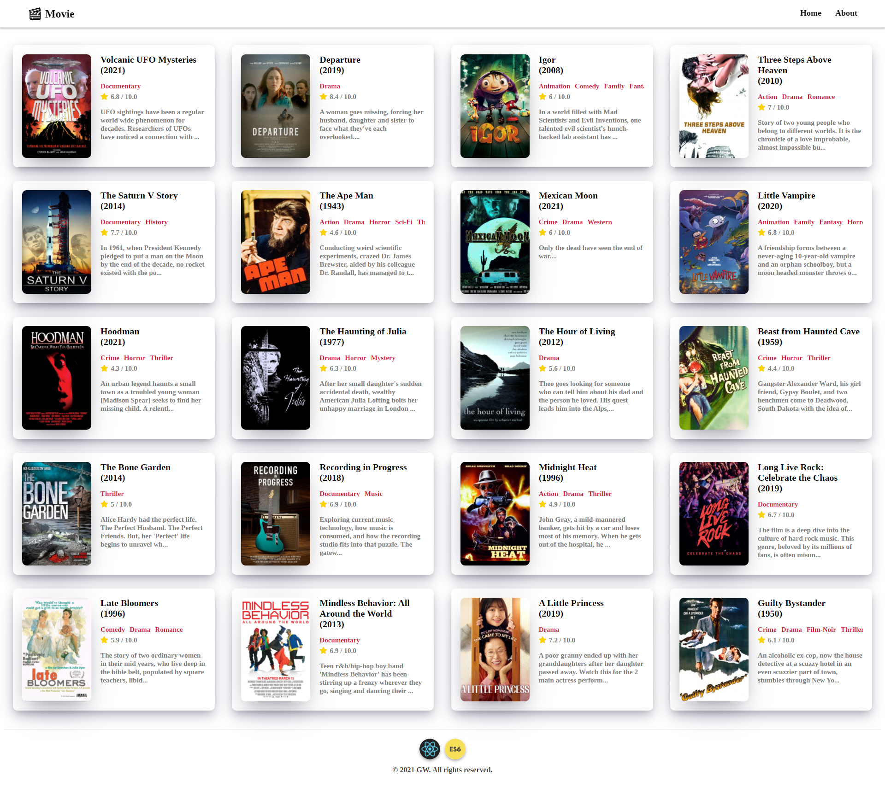

# React-Movie-App

## 🔗 Demo
https://githubgw.github.io/react-movie-app

## 🖥 Preview

## 🔥 Stack
### Front-end
  

## ✅ Packages
- [x] React
- [x] Axios
- [x] React Router
- [x] GitHub Pages

## 📖 Theory
- [x] JSX
- [x] State
- [x] Props
- [x] Class Components
- [x] Data Fetching
- [x] Routing
